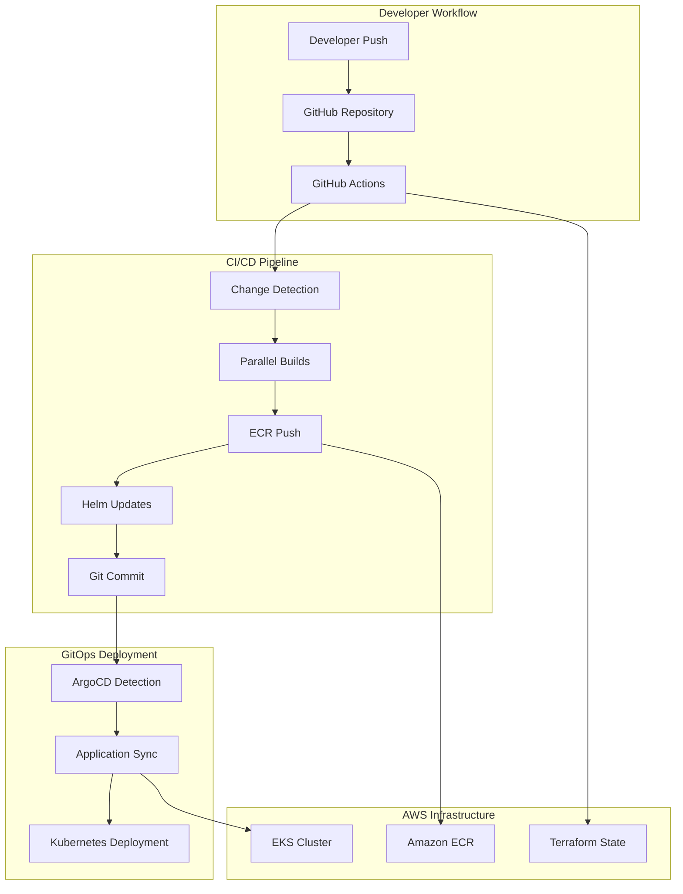
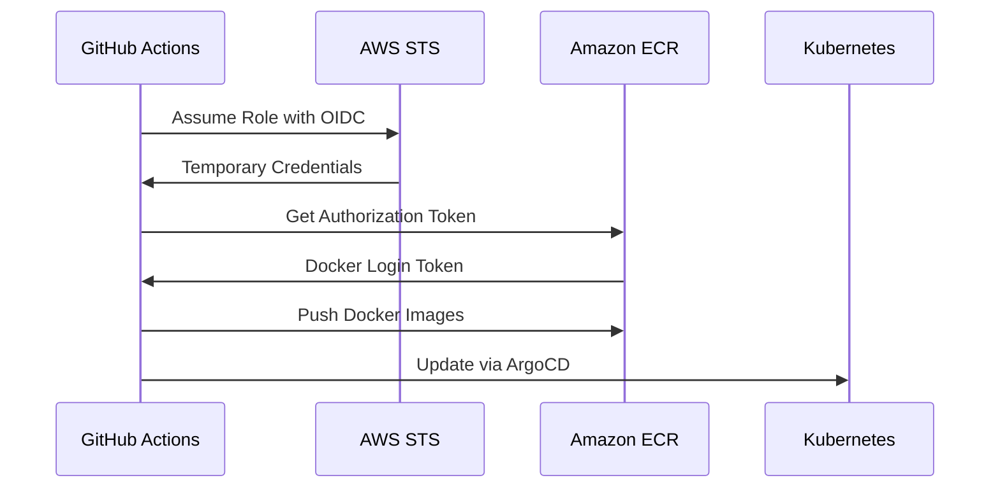

# CI/CD Workflow Design Document

## Overview

This design document outlines a comprehensive CI/CD workflow system for the retail store sample application. The system implements a GitOps-based approach using GitHub Actions, Amazon ECR, and ArgoCD to provide automated, secure, and scalable deployment pipelines for multiple microservices.

The design focuses on intelligent change detection, parallel processing, secure credential management, and seamless integration with existing infrastructure components.

## Architecture

### High-Level Architecture



### Workflow Stages

1. **Trigger Stage**: Detects repository changes and initiates pipeline
2. **Analysis Stage**: Identifies which services have been modified
3. **Build Stage**: Parallel Docker image builds for changed services
4. **Registry Stage**: Pushes images to ECR with proper tagging
5. **Update Stage**: Modifies Helm charts and ArgoCD configurations
6. **Commit Stage**: Pushes changes back to repository
7. **Sync Stage**: ArgoCD detects changes and deploys to Kubernetes

## Components and Interfaces

### 1. Change Detection Component

**Purpose**: Intelligently detect which microservices have been modified

**Implementation**:
- Uses `dorny/paths-filter` GitHub Action
- Monitors specific paths for each service (`src/ui/**`, `src/cart/**`, etc.)
- Outputs boolean flags for each service
- Supports both push and pull request triggers

**Interface**:
```yaml
inputs:
  - repository_changes: git_diff
outputs:
  - service_flags: boolean_map
```

**Configuration**:
```yaml
filters: |
  ui: 'src/ui/**'
  cart: 'src/cart/**'
  catalog: 'src/catalog/**'
  checkout: 'src/checkout/**'
  orders: 'src/orders/**'
```

### 2. Build Orchestrator Component

**Purpose**: Manages parallel builds for multiple services

**Implementation**:
- Uses GitHub Actions matrix strategy
- Conditional execution based on change detection
- Parallel processing for independent services
- Shared build context and caching

**Interface**:
```yaml
inputs:
  - service_name: string
  - change_detected: boolean
  - build_context: docker_context
outputs:
  - image_digest: string
  - build_status: success|failure
```

**Matrix Configuration**:
```yaml
strategy:
  matrix:
    service: [ui, cart, catalog, checkout, orders]
  fail-fast: false
```

### 3. ECR Management Component

**Purpose**: Handles Docker image registry operations

**Implementation**:
- Automatic ECR repository creation
- Multi-tag image pushing (commit SHA + latest)
- Lifecycle policy management
- Security scanning enablement

**Interface**:
```yaml
inputs:
  - image_name: string
  - image_tags: string_array
  - aws_credentials: secure_context
outputs:
  - repository_url: string
  - push_status: success|failure
```

**Repository Configuration**:
```hcl
resource "aws_ecr_repository" "service" {
  name                 = "retail-store-${service}"
  image_tag_mutability = "MUTABLE"
  
  image_scanning_configuration {
    scan_on_push = true
  }
  
  encryption_configuration {
    encryption_type = "AES256"
  }
}
```

### 4. Helm Chart Updater Component

**Purpose**: Updates Helm chart values with new image references

**Implementation**:
- Regex-based value replacement in YAML files
- Atomic updates for multiple services
- Validation of YAML syntax after updates
- Backup and rollback capabilities

**Interface**:
```yaml
inputs:
  - service_name: string
  - new_image_tag: string
  - chart_path: string
outputs:
  - update_status: success|failure
  - modified_files: string_array
```

**Update Logic**:
```bash
sed -i "s|tag:.*|tag: \"${IMAGE_TAG}\"|g" src/${service}/chart/values.yaml
sed -i "s|repository:.*|repository: \"${ECR_REGISTRY}/retail-store-${service}\"|g" src/${service}/chart/values.yaml
```

### 5. GitOps Integration Component

**Purpose**: Manages Git operations and ArgoCD integration

**Implementation**:
- Automated commit creation with descriptive messages
- Branch protection and conflict resolution
- ArgoCD application manifest updates
- Commit signing and verification

**Interface**:
```yaml
inputs:
  - modified_files: string_array
  - commit_message: string
  - target_branch: string
outputs:
  - commit_sha: string
  - push_status: success|failure
```

**Commit Strategy**:
```bash
git add .
git commit -m "Update image tags to ${GITHUB_SHA} [skip ci]"
git push origin ${GITHUB_REF_NAME}
```

### 6. Security Management Component

**Purpose**: Handles authentication, authorization, and secret management

**Implementation**:
- GitHub Secrets integration
- AWS IAM role assumption
- Temporary credential management
- Audit logging and compliance

**Interface**:
```yaml
inputs:
  - github_secrets: secure_context
outputs:
  - aws_credentials: temporary_credentials
  - ecr_token: temporary_token
```

**Security Configuration**:
```yaml
permissions:
  id-token: write
  contents: read
  packages: write
```

## Data Models

### 1. Service Configuration Model

```yaml
Service:
  name: string
  path: string
  dockerfile_path: string
  chart_path: string
  ecr_repository: string
  build_context: BuildContext
  dependencies: Service[]

BuildContext:
  dockerfile: string
  build_args: map[string]string
  target_stage: string
  platform: string[]
```

### 2. Pipeline State Model

```yaml
PipelineExecution:
  id: string
  trigger: TriggerEvent
  services: ServiceBuild[]
  status: ExecutionStatus
  created_at: timestamp
  completed_at: timestamp

ServiceBuild:
  service: Service
  changed: boolean
  build_status: BuildStatus
  image_digest: string
  ecr_url: string

TriggerEvent:
  type: push|pull_request
  branch: string
  commit_sha: string
  author: string
```

### 3. Infrastructure State Model

```yaml
ECRRepository:
  name: string
  url: string
  region: string
  lifecycle_policy: LifecyclePolicy
  scan_configuration: ScanConfig

LifecyclePolicy:
  rules: PolicyRule[]

PolicyRule:
  priority: integer
  description: string
  selection: SelectionCriteria
  action: PolicyAction
```

## Error Handling

### 1. Build Failures

**Strategy**: Fail-fast with detailed diagnostics

**Implementation**:
- Capture build logs and artifacts
- Provide specific error messages for common issues
- Support for build retry with exponential backoff
- Notification to relevant stakeholders

**Error Categories**:
- Docker build failures
- Dependency resolution issues
- Resource constraints
- Network connectivity problems

### 2. Registry Operations

**Strategy**: Retry with circuit breaker pattern

**Implementation**:
- Automatic retry for transient failures
- Circuit breaker for persistent ECR issues
- Fallback to alternative registries if configured
- Detailed logging for troubleshooting

**Retry Configuration**:
```yaml
retry:
  max_attempts: 3
  backoff_factor: 2
  initial_delay: 5s
```

### 3. Git Operations

**Strategy**: Conflict resolution and merge strategies

**Implementation**:
- Automatic conflict resolution for simple cases
- Manual intervention triggers for complex conflicts
- Branch protection bypass for CI commits
- Rollback capabilities for failed updates

### 4. ArgoCD Integration

**Strategy**: Monitoring and alerting for sync failures

**Implementation**:
- Health checks for ArgoCD connectivity
- Sync status monitoring and reporting
- Automatic retry for failed syncs
- Manual intervention triggers for persistent issues

## Testing Strategy

### 1. Unit Testing

**Scope**: Individual workflow components and scripts

**Implementation**:
- GitHub Actions workflow validation
- Shell script testing with bats
- YAML syntax validation
- Terraform configuration testing

**Test Categories**:
- Change detection logic
- Image tagging algorithms
- Helm value update functions
- Git operation scripts

### 2. Integration Testing

**Scope**: End-to-end workflow execution

**Implementation**:
- Test repository with sample services
- Mock ECR and ArgoCD endpoints
- Parallel execution testing
- Error scenario simulation

**Test Scenarios**:
- Single service changes
- Multiple service changes
- No changes detected
- Build failures and recovery

### 3. Security Testing

**Scope**: Authentication, authorization, and secret handling

**Implementation**:
- Credential exposure detection
- Permission boundary testing
- Secret rotation validation
- Audit log verification

**Security Checks**:
- No secrets in logs or outputs
- Proper IAM role assumptions
- ECR access controls
- Git commit signing

### 4. Performance Testing

**Scope**: Build times, resource usage, and scalability

**Implementation**:
- Build time benchmarking
- Resource consumption monitoring
- Parallel execution limits
- Cache effectiveness measurement

**Performance Metrics**:
- Average build time per service
- ECR push/pull speeds
- Git operation latency
- Overall pipeline duration

## Deployment Considerations

### 1. Environment Configuration

**Development Environment**:
- Separate ECR repositories with dev prefix
- Relaxed security policies for testing
- Extended logging and debugging
- Manual approval gates

**Production Environment**:
- Strict security policies and scanning
- Automated deployment with monitoring
- Rollback capabilities
- Compliance audit trails

### 2. Scaling Considerations

**Horizontal Scaling**:
- GitHub Actions runner pools
- Parallel service builds
- ECR repository sharding
- ArgoCD application distribution

**Vertical Scaling**:
- Build resource allocation
- Docker layer caching
- Network bandwidth optimization
- Storage performance tuning

### 3. Monitoring and Observability

**Metrics Collection**:
- Pipeline execution metrics
- Build success/failure rates
- ECR usage statistics
- ArgoCD sync performance

**Alerting Strategy**:
- Build failure notifications
- Security scan alerts
- Resource usage warnings
- Deployment status updates

**Logging Strategy**:
- Structured logging with correlation IDs
- Centralized log aggregation
- Retention policies
- Search and analysis capabilities

### 4. Disaster Recovery

**Backup Strategy**:
- ECR image replication
- Git repository mirrors
- Terraform state backups
- Configuration snapshots

**Recovery Procedures**:
- ECR repository restoration
- Pipeline configuration recovery
- ArgoCD application restoration
- Service deployment rollback

## Security Architecture

### 1. Authentication Flow



### 2. Permission Model

**GitHub Actions Permissions**:
```yaml
permissions:
  id-token: write      # OIDC token creation
  contents: write      # Repository modifications
  packages: write      # Container registry access
  pull-requests: read  # PR information access
```

**AWS IAM Policy**:
```json
{
  "Version": "2012-10-17",
  "Statement": [
    {
      "Effect": "Allow",
      "Action": [
        "ecr:GetAuthorizationToken",
        "ecr:BatchCheckLayerAvailability",
        "ecr:GetDownloadUrlForLayer",
        "ecr:BatchGetImage",
        "ecr:BatchImportLayerPart",
        "ecr:CompleteLayerUpload",
        "ecr:DescribeRepositories",
        "ecr:CreateRepository",
        "ecr:InitiateLayerUpload",
        "ecr:PutImage",
        "ecr:UploadLayerPart"
      ],
      "Resource": "*"
    }
  ]
}
```

### 3. Secret Management

**GitHub Secrets**:
- `AWS_ACCESS_KEY_ID`: IAM user access key
- `AWS_SECRET_ACCESS_KEY`: IAM user secret key
- `AWS_REGION`: Target AWS region
- `AWS_ACCOUNT_ID`: AWS account identifier

**Runtime Security**:
- No secrets in workflow logs
- Temporary credential usage
- Automatic secret rotation support
- Audit trail for secret access

This design provides a robust, scalable, and secure CI/CD workflow that meets all the specified requirements while maintaining flexibility for future enhancements and customizations.